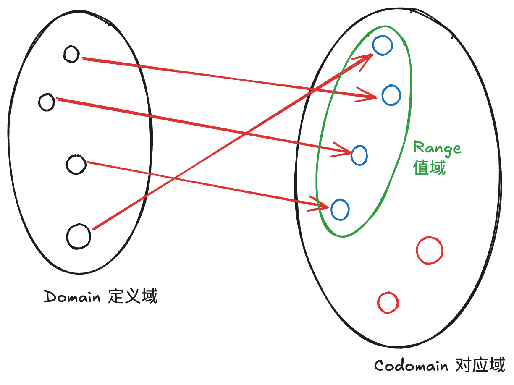
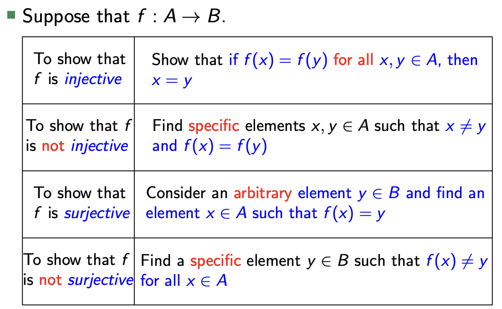
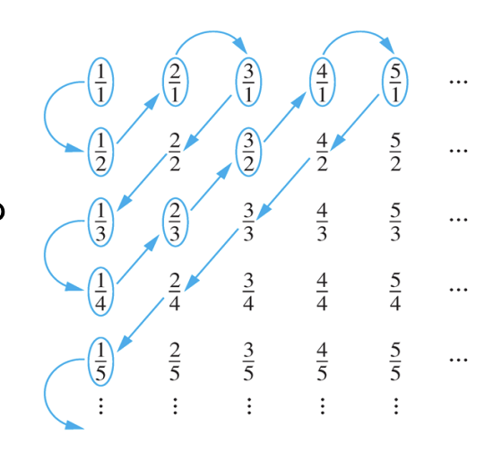
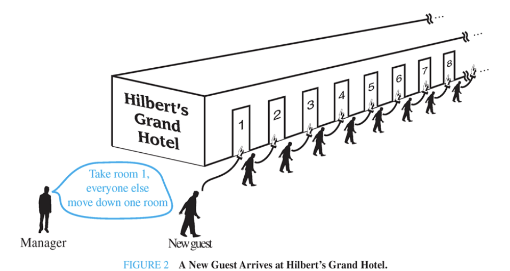

# 基本结构：集合、函数、序列、求和与矩阵

简单的基本概念不再赘述，只补充一些新概念以及英文表述。可以根据概念表速查是否有缺漏。

## Sets  

### Basic Concepts

- 集合的表示方法
  - listing 枚举
  - ellipsis 省略
  - properties 特性描述
- Important sets
  - $N, Z, Q（有理数）, R, C$
- Universal set, empty set
- Interval Notation 区间表示法
  - [],(),[),(]
- Equality Two sets A, B are equal if and only if $\forall x(x\in A \leftrightarrow x\in B)$.
- Venn Diagrams 维恩图
- Proper Subsets and Properties 真子集、子集
  - subset $A\subseteq B$ proof: $\forall x(x\in A \rightarrow x\in B)$
  - proper subset $A\subset B$ proof: $\forall x(x\in A \rightarrow x\in B) \land \exists x(x\in B \land x\notin A)$
- Power set $P(S)$ 幂集：$P(S)=\{A|A\subseteq S\}$，if $|S|=n$, then $|P(S)|=2^n$.

A set is an unordered collection of objects. These objects are called **elements** or **members**.

### Russell’s Paradox 罗素悖论

Let $S=\{x|x\notin x\}$, that are not members of themselves.

Is $S\in S$?

中文表述：设$S$是所有不包含自己的集合的集合，那么$S$是否包含自己？

- If $S\in S$, then by definition of $S$, $S\notin S$.
- If $S\notin S$, then by definition of $S$, $S\in S$. This is a contradiction.  

## Tuple 元组

- ordered list of elements 元组是有顺序的集合

### Cartesian Product笛卡尔积

Let A and B be sets. The **Cartesian product** of A and B, denoted by $A\times B$, is the set of all ordered pairs $(a,b)$, where $a\in A$ and $b\in B$.

Example: $A=\{1,2\}, B=\{a,b\}$  
Then  
$$A\times B=\{(1,a),(1,b),(2,a),(2,b)\}$$

$A\times B \neq B\times A$

$|A\times B|=|A|\times|B|$

## set operation  

1. Union 并集
2. Intersection 交集
3. Complement 补集
4. Difference 差集

## Disjoint Sets 互不相交集合

Two sets A and B are called disjoint if their intersection is empty.$A\cap B=\emptyset$

## the principle of inclusion and exclusion 容斥原理

$|A\cup B|=|A|+|B|-|A\cap B|$

## Set Identities

- Identity Laws 恒等律
  - $A\cup \emptyset=A$
  - $A\cap U=A$
- Domination Laws 吸收律
  - $A\cup U=U$
  - $A\cap \emptyset=\emptyset$
- Idempotent Laws 幂等律
  - $A\cup A=A$
  - $A\cap A=A$
- Complemenntation Laws 双反律
  - $A''=A$
- Commutative Laws 交换律
  - $A\cup B=B\cup A$
  - $A\cap B=B\cap A$
- Associative Laws 结合律
  - $(A\cup B)\cup C=A\cup (B\cup C)$
  - $(A\cap B)\cap C=A\cap (B\cap C)$
- Distributive Laws 分配律
  - $A\cup (B\cap C)=(A\cup B)\cap (A\cup C)$
  - $A\cap (B\cup C)=(A\cap B)\cup (A\cap C)$
- De Morgan's Laws 德摩根定律
  - $(A\cup B)'=A'\cap B'$
  - $(A\cap B)'=A'\cup B'$
- Absorption Laws 吸收律
  - $A\cup (A\cap B)=A$
  - $A\cap (A\cup B)=A$
- Complement Laws 补律
  - $A\cup A'=U$
  - $A\cap A'=\emptyset$

## Functions 函数

### Basic Concepts

- Domain 定义域, Codomain 对应域、到达域, Range 值域

- preimage, image 原像、像
- injective(one to one) 单射, surjective(onto) 满射, bijective(both one-to-one and onto/One-to-One Correspondence) 双射

---
证明单射、漫射、双射的方法：

---

- inverse function 反函数；只能对双射定义
- composition of functions 函数的复合 $f\circ g(x)=f(g(x))$
- identity function 恒等函数 $f(x)=x$
  - Suppose that $f:A\rightarrow B$ is a function. Then $f\circ f^{-1}=I_B$ and $f^{-1}\circ f=I_A$.
- floor function, ceiling function 分别用 $\lfloor x\rfloor, \lceil x\rceil$表示
- factorial 阶乘 $n!=n(n-1)(n-2)\cdots 3\cdot 2\cdot 1$

## Sequences 序列

- A sequence is a function whose domain is the set of **positive integers** {0,1,2,...} or{1,2,3,...}.
- arithmetic progression 等差数列
- geometric progression 等比数列
- infinite sequence 无穷级数

### Recursive Definitions Sequences 递归定义级数

The n-th element of the sequence ${a_n}$ is definedrecursively in terms of the **previous elements** of the sequence and the initial elements of the sequence.

### Summation Notation 求和符号

- $\sum_{i=1}^{n}a_i=a_1+a_2+\cdots+a_n$

#### Some useful Summation Formulas

- $\sum_{i=1}^{n}c=c\cdot n$
- $\sum_{i=1}^{n}i=\frac{n(n+1)}{2}$
- $\sum_{i=1}^{n}i^2=\frac{n(n+1)(2n+1)}{6}$
- $\sum_{i=1}^{n}i^3=\left(\frac{n(n+1)}{2}\right)^2$
- $\sum_{i=1}^{n}ar^k=\frac{a-ar^{n+1}}{1-r}\ (r\neq 1)$
- $\sum_{i=1}^{\infty}x^i=\frac{1}{1-x}\ (|x|<1)$
- $\sum_{i=1}^{n}i\cdot a^{i-1}=\frac{1-a^n}{(1-a)^2}$

### Cardinality of Sets 集合的基数

集合中不同元素的个数称为集合的Cardinality，基数，记作$|S|$。

#### Countable Sets 可数集

A set is countable if it is finite or its elements can be put into one-to-one correspondence with the $\mathbf{Z}^+$.
可数集是有限集或者可以和正整数集一一对应，并不等价于**有限集**。

To prove :

1. Listing
2. find a bijection $f:S\rightarrow \mathbf{Z}^+ /f:\mathbf{Z}^+\rightarrow S$

### Example 1: A = {0,2,4,6,8,...} is countable.

Proof. 寻找是否存在一个在$A$和$\mathbf{Z}^+$之间的双射。

Define $f: \mathbf{Z}^+\rightarrow A$ by $f(x)=2x-2$.

1. one-to-one: $f(x)=f(y)\rightarrow 2x-2=2y-2\rightarrow x=y$
2. onto: $\forall a\in A,\frac{a+2}{2}$ is the preimage in $Z^+$.

### Example 2: The set of integers $\mathbf{Z}$ is countable.

Solution. Define $f:\mathbf{Z}^+\rightarrow \mathbf{Z}$ by $f(x)=\left\{\begin{aligned} \frac{x}{2} &\quad x\ is\ even \\ -\frac{x+1}{2} &\quad x\ is\ odd \end{aligned}\right.$

### Example 3: The set of rational numbers $\mathbf{Q}$ is countable.

Solution. Constructing the list: first list p/q with p+q=2, then p+q=3, and so on.

## Uncountable Sets 不可数集

### Theorem: The set of real numbers $\mathbf{R}$ is uncountable.

Proof by contradiction.

Assume that $\mathbf{R}$ is countable, then every subset of $\mathbf{R}$ is countable, in particular, the interval $(0,1)$ is countable. This implies that the elements of this set can be listed as $r_1,r_2,r_3,...$. where

- $r_1=0.d_{11}d_{12}d_{13}...$
- $r_2=0.d_{21}d_{22}d_{23}...$
- $r_3=0.d_{31}d_{32}d_{33}...$

all $d_{ij} \in {0,1,2,...,9}$

Form a new number $r=0.d_1d_2d_3...$, where $d_i\neq 1$ if $d_{ii}=1$, and $d_i=1$ if $d_{ii}\neq 1$.

$r$ is not in the list, so the assumption that $\mathbf{R}$ is countable is false.

r is different from $r_1,r_2,r_3,...$ in the i-th decimal place.

r至少在第i位小数点上与$r_i$不同。所以$r$不在列表中。

这种方法称为**对角线方法**Cantor diagonalization argument。

## Schr¨oder-Bernstein Theorem 施罗德-伯恩斯坦定理

If there exist injective functions $f:A\rightarrow B$ and $g:B\rightarrow A$, then there exists a bijective function $h:A\rightarrow B$.

如果存在单射$f:A\rightarrow B$和$g:B\rightarrow A$，那么存在双射$h:A\rightarrow B$。
也可以表述为：如果$|A|\leq |B|$且$|B|\leq |A|$，那么$|A|=|B|$。

通俗的说，如果一个酒店有可数的无穷多个房间，而且每个房间都有一个人住，那么我们总可以让一个新来的人住进来。

### 证明：

TODO

### 使用施罗德-伯恩斯坦定理证明两个集合的基数相等

#### Example1: Show that $|(0,1)|=|(0,1]|$.

Solution.

Define $f:(0,1)\rightarrow (0,1]$ by $f(x)=x$

Define g:$(0,1]\rightarrow (0,1)$ by $g(x)=\frac{x}{2}$

#### Example2: Show that $|(0,1)|=|\mathbb{R}|$.

Solution.

Define $f:(0,1)\rightarrow \mathbb{R}$ by $f(x)=x$

Define $g:\mathbb{R}\rightarrow (0,1)$ by $g(x)=\frac{1}{\pi}\tan^{-1}(x)+\frac{1}{2}$

## Comutable vs Uncomputable Sets 可计算与不可计算集合

We say that a function is computable if there is a computer program in some programming language that finds the values of this function. If a function is not **computable**, we say it is **uncomputable**.

如果一个计算机程序可以计算出这个函数的值，那么这个函数是可计算的。否则是不可计算的。

---

- **Theorem:There are functions that are not computable**

Proof.

1. prove that the set of computer programs is countable infinite.
2. prove that the set of functions from $\mathbf{Z}^+$ to $\{0,1\}$ is uncountable infinite.

## Cantor's Theorem 康托尔定理

- **If S is a set, then $|S|<|P(S)|$.**

Proof.

1. $|S|\leq |P(S)|$
2. $|S|\neq |P(S)|$

https://www.zhihu.com/question/325521510

> 对于任意两个集合A和B，满射意味着他们的势：$|A|\geq |B|$，所以非满射意味着$|A|<|B|$。

所以要证明一个集合A小于另一个集合B，只需要证明不存在从A到B的满射即可。

如果A到P(A)存在满射，那意味着p(A)中每个元素至少拥有一个从A的元素映射过来的箭头，所以若能证明P(A)中有个元素(即A的一个子集)它没有映射箭头即可证明非满射。

使用g表示映射函数，那么就是说，找到A的一个不被g作用的子集即可。

我们将这个子集(也就是P(A)的一个元素)用Ag表示,构造:

$Ag=\{x\in A|x\notin g(x)\}$

现在证明，A中没有元素对应P(A)中的元素Ag(Ag是一个集合)

用**反证法**，假设存在一个元素a，使得g(a)=Ag.

那么，这个A中的元素a在A中的哪个地方？在不在A的子集A里？

- 如果a在Ag中，那么a就是满足Ag的定义，所以$a\notin g(a)$，这与$g(a)=Ag$而$a\in Ag$矛盾。
- 如果a不在Ag中，那么a就不满足Ag的定义，所以$a\in g(a)$，这与$g(a)=Ag$而$a\notin Ag$矛盾。

所以不存在这样的a，所以g不是一个满射，所以$|A|<|P(A)|$。